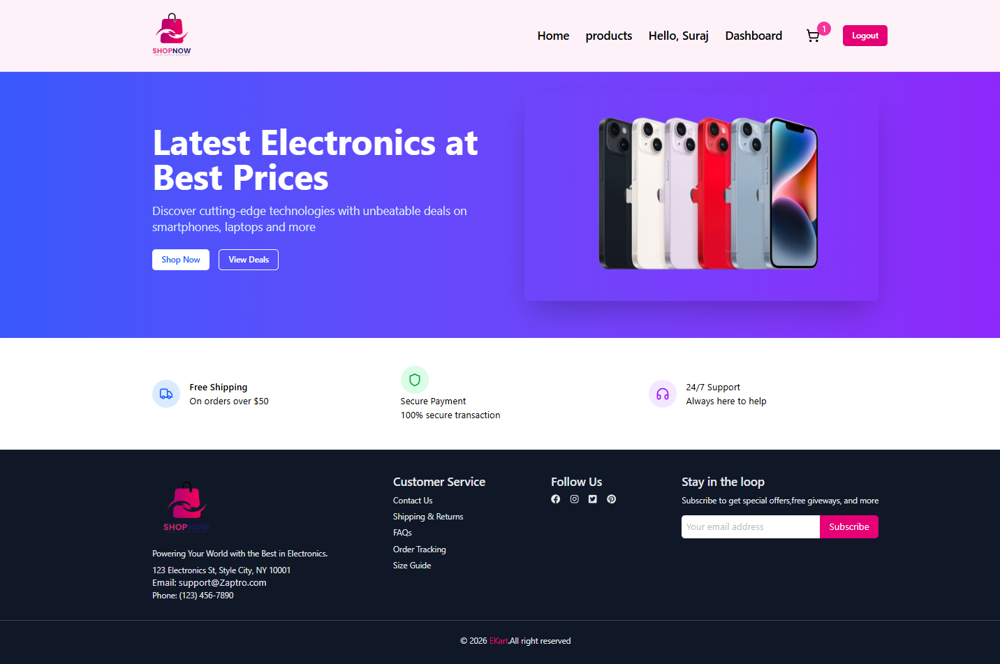
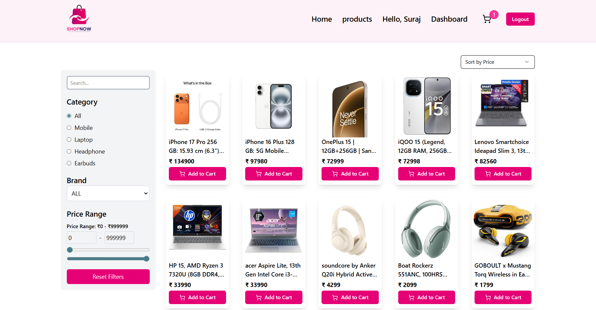
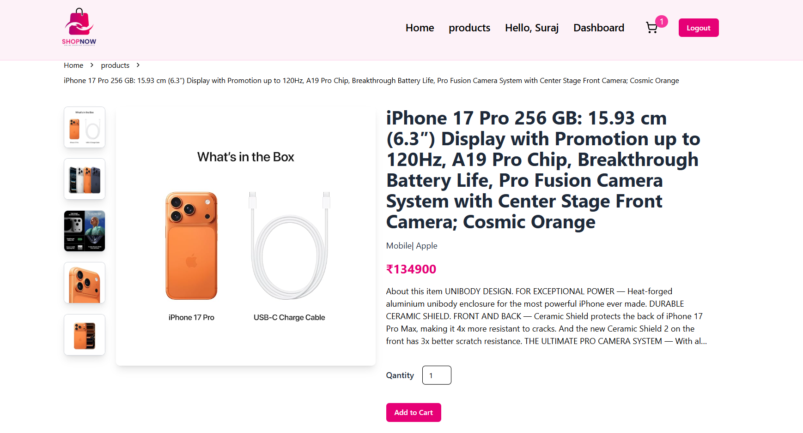
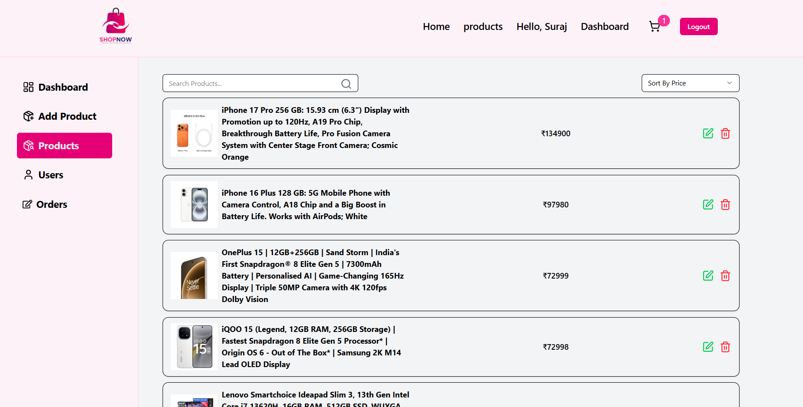
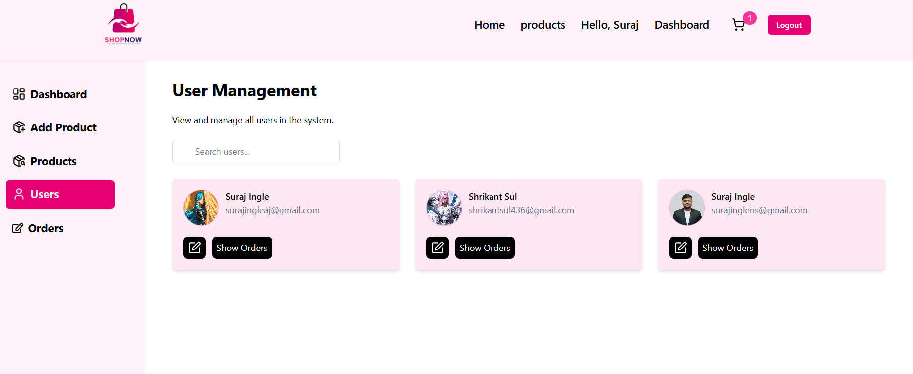
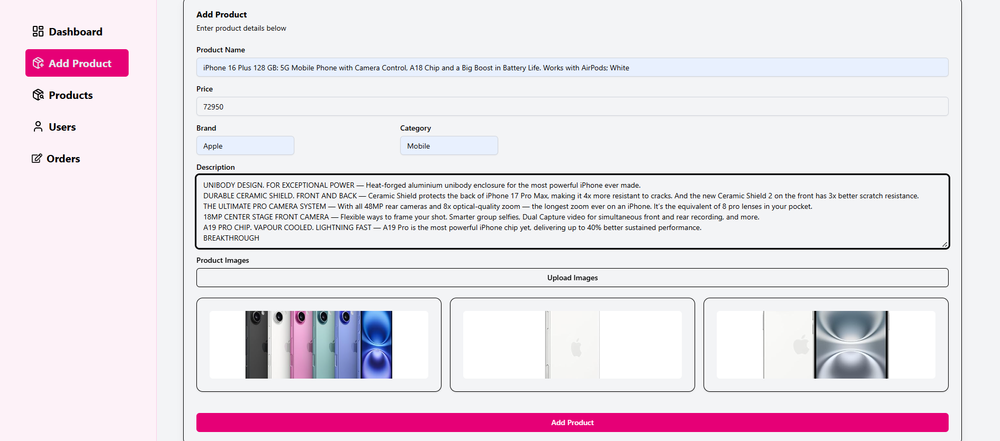
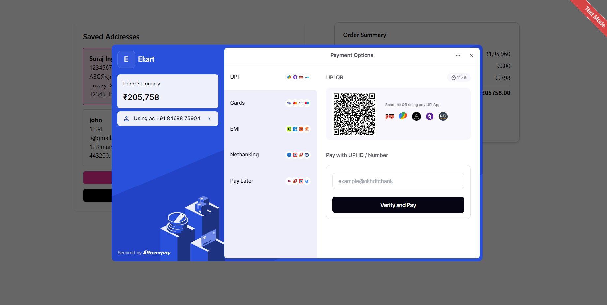

# 🛒 E-Commerce Website | MERN Stack

A complete **full-stack E-Commerce web application** built using the **MERN stack**, designed with a focus on **security, scalability, and real-world functionality**.

---

## 🚀 Project Overview
This project implements a production-style E-Commerce platform with **role-based access**, **secure authentication**, and **online payment integration**.

---

## 🔐 Authentication & User Management
- Secure **User Sign Up & Login**
- **Email verification** using automated email services
- **JWT-based authentication**
- **Role-based access control**:
  - Admin Panel
  - User Panel

---

## 🛠️ Admin & User Features

### 🛠️ Admin Panel
- Add, update, and delete products
- Manage users and product data
- Full access to application functionalities

### 👤 User Panel
- Browse products with complete details
- Secure and limited access
- User-friendly shopping experience

---

## 💳 Payments & Security
- Integrated **Razorpay** for secure online payments
- Safe handling of user and transaction data
- Secure backend API implementation

---

## 🌐 Backend & Database
- Developed **RESTful APIs** using **Node.js & Express.js**
- API testing and validation using **Postman**
- **MongoDB** used to store:
  - User data
  - Product details
  - Orders
  - Payment information

---

## 🧰 Tech Stack & Tools

### Frontend
- React.js
- HTML5
- CSS3
- JavaScript

### Backend
- Node.js
- Express.js

### Database
- MongoDB

### Tools & Services
- Postman (API Development & Testing)
- JWT (Authentication)
- Email Verification Services
- Razorpay (Payment Gateway)

---

## 📚 Learning Outcomes
- Full-stack application development
- Secure authentication & authorization
- REST API design and testing
- Payment gateway integration
- Real-world project architecture

---
## 📸 Project Screenshots

### 🏠 Home Page


### 🛍️ Products Page


### 📦 Single Product Page


### ✏️ Product Edit Page


### 👤 User Controller


### ➕ Product Add Page


### 💳 Payment Page



## ▶️ How to Run Locally

```bash
# Clone the repository
git clone https://github.com/your-username/Ekart.git

# Install backend dependencies
cd server
npm install

# Install frontend dependencies
cd ../client
npm install

# Run backend
npm start

# Run frontend
npm run dev
